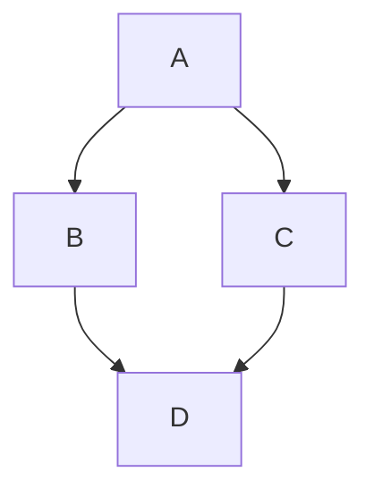

本文介绍 Markdown 扩展功能，包括语法示例与效果展示。
*示例取自 [Retypeset](https://retypeset.radishzz.cc/en/posts/markdown-extended-features/)*

## 图注

使用标准的 Markdown 图像语法 ``，即可自动生成图注。在 `alt` 前添加下划线 `_` 或留空 `alt`，即可隐藏图注。

### 语法

```


```

### 效果


## 提示块

使用 GitHub 语法 `> [!TYPE]` 或三冒号语法 `:::type`，即可创建提示块。支持 `note`、`tip`、`important`、`warning`、`caution` 五种类型。

### 语法

```
> [!NOTE]
> 即使快速浏览，也值得用户留意的信息。

> [!TIP]
> 可选信息，可帮助用户更轻松地完成操作。

> [!IMPORTANT]
> 用户成功所需的关键信息。

:::warning
由于存在潜在风险，需要用户立即关注的关键内容。
:::

:::caution
某些操作可能带来的负面后果。
:::

:::note[自定义标题]
这是一个自定义标题的提示块。
:::
```

### 效果

> [!NOTE]-
> 即使快速浏览，也值得用户留意的信息。

> [!TIP]
> 可选信息，可帮助用户更轻松地完成操作。

> [!IMPORTANT]
> 用户成功所需的关键信息。

:::warning
由于存在潜在风险，需要用户立即关注的关键内容。
:::

:::caution
某些操作可能带来的负面后果。
:::

:::note[自定义标题]
这是一个自定义标题的提示块。
:::

### Obsidian 风格

```markdown
> [!note]
> A short note.

> [!warning]- 默认折叠
> 点击标题展开。

> [!tip]+ 默认展开
> 仍然可以手动收起。
```

实际效果：

> [!note]
> A short note.

> [!warning]- 默认折叠
> 点击标题展开。

> [!tip]+ 默认展开
> 仍然可以手动收起。

## 折叠块

使用三冒号语法 `:::fold[title]`，即可创建折叠块。点击标题可以展开或收起。

### 语法

```
:::fold[使用提示]
如果需要添加并非所有读者都会感兴趣的内容，可以将其放在折叠块中。
:::
```

### 效果

:::fold[使用提示]
如果需要添加并非所有读者都会感兴趣的内容，可以将其放在折叠块中。
:::

## Mermaid 图表

使用代码块包裹 Mermaid 语法，并标注语言类型 `mermaid`，即可创建 Mermaid 图表。

### 语法

``````

``````

### 效果


## 画廊

使用三冒号语法 `:::gallery`，即可创建图片画廊。水平滚动以查看更多图片。

### 语法

```
:::gallery


:::
```

### 效果

:::gallery


:::

## GitHub 仓库

使用双冒号语法 `::github{repo="owner/repo"}`，即可嵌入 GitHub 仓库。

### 语法

```
::github{repo="StatIndet/daybook"}
```

### 效果

::github{repo="StatIndet/daybook"}

## 视频

使用双冒号语法 `::youtube{id="video-id"}`，即可嵌入视频。

### 语法

```
::youtube{id="9pP0pIgP2kE"}

::bilibili{id="BV1sK4y1Z7KG"}
```

### 效果

::youtube{id="9pP0pIgP2kE"}

::bilibili{id="BV1sK4y1Z7KG"}

## Spotify

使用双冒号语法 `::spotify{url="spotify-url"}`，即可嵌入 Spotify 内容。

### 语法

```
::spotify{url="https://open.spotify.com/track/0HYAsQwJIO6FLqpyTeD3l6"}

::spotify{url="https://open.spotify.com/album/03QiFOKDh6xMiSTkOnsmMG"}
```

### 效果

::spotify{url="https://open.spotify.com/track/0HYAsQwJIO6FLqpyTeD3l6"}

::spotify{url="https://open.spotify.com/album/03QiFOKDh6xMiSTkOnsmMG"}

## X 推文

使用双冒号语法 `::tweet{url="tweet-url"}`，即可嵌入 X 推文。

### 语法

```
::tweet{url="https://x.com/hachi_08/status/1906456524337123549"}
```

### 效果

::tweet{url="https://x.com/hachi_08/status/1906456524337123549"}

## CodePen

使用双冒号语法 `::codepen{url="codepen-url"}`，即可嵌入 CodePen 演示。

### 语法

```
::codepen{url="https://codepen.io/jh3y/pen/NWdNMBJ"}
```

### 效果

::codepen{url="https://codepen.io/jh3y/pen/NWdNMBJ"}

