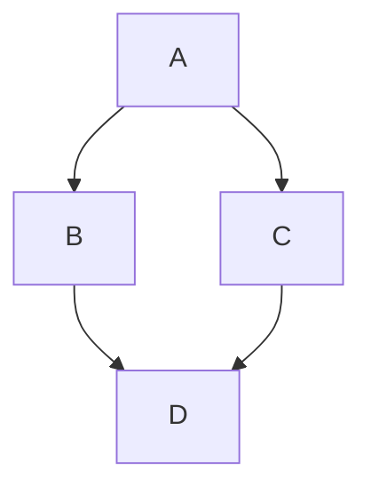

This article introduces extended Markdown features, including syntax examples and rendered previews.

_Examples are taken from [Retypeset](https://retypeset.radishzz.cc/en/posts/markdown-extended-features/)._

## Figure Captions

To create automatic figure captions, use the standard Markdown image syntax ``. To hide the caption, add an underscore `_` before the `alt` text or leave the `alt` text empty.

### Syntax

```


```

### Output


## Admonition Blocks

To create admonition blocks, use the GitHub syntax `> [!TYPE]` or the container directive `:::type`. The following types are supported: `note`, `tip`, `important`, `warning`, and `caution`.

### Syntax

```
> [!NOTE]
> Useful information that users should know, even when skimming content.

> [!TIP]
> Helpful advice for doing things better or more easily.

> [!IMPORTANT]
> Key information users need to know to achieve their goal.

:::warning
Urgent info that needs immediate user attention to avoid problems.
:::

:::caution
Advises about risks or negative outcomes of certain actions.
:::

:::note[YOUR CUSTOM TITLE]
This is a note with a custom title.
:::
```

### Output

> [!NOTE]
> Useful information that users should know, even when skimming content.

> [!TIP]
> Helpful advice for doing things better or more easily.

> [!IMPORTANT]
> Key information users need to know to achieve their goal.

:::warning
Urgent info that needs immediate user attention to avoid problems.
:::

:::caution
Advises about risks or negative outcomes of certain actions.
:::

:::note[YOUR CUSTOM TITLE]
This is a note with a custom title.
:::

### Obsidian Style

```markdown
> [!note]
> A short note.

> [!warning]- Collapsed by default
> Click the title to expand.

> [!tip]+ Expanded by default
> You can still collapse it manually.
```

Actual result:

> [!note]
> A short note.

> [!warning]- Collapsed by default
> Click the title to expand.

> [!tip]+ Expanded by default
> You can still collapse it manually.

## Collapsible Sections

To create collapsible sections, use the container directive syntax `:::fold[title]`. Click the title to expand or collapse.

### Syntax

```
:::fold[Usage Tips]
Content that may not interest all readers can be placed in a collapsible section.
:::
```

### Output

:::fold[Usage Tips]
Content that may not interest all readers can be placed in a collapsible section.
:::

## Mermaid Diagrams

To create Mermaid diagrams, wrap Mermaid syntax in code blocks and specify the language type as `mermaid`.

### Syntax

``````

``````

### Output


## Galleries

To create image galleries, use the container directive `:::gallery`. Scroll horizontally to view more images.

### Syntax

```
:::gallery


:::
```

### Output

:::gallery


:::

## GitHub Repositories

To embed GitHub repositories, use the leaf directive `::github{repo="owner/repo"}`.

### Syntax

```
::github{repo="StatIndet/daybook"}
```

### Output

::github{repo="StatIndet/daybook"}

## Videos

To embed videos, use the leaf directive `::youtube{id="video-id"}`.

### Syntax

```
::youtube{id="9pP0pIgP2kE"}

::bilibili{id="BV1sK4y1Z7KG"}
```

### Output

::youtube{id="9pP0pIgP2kE"}

::bilibili{id="BV1sK4y1Z7KG"}

## Spotify

To embed Spotify content, use the leaf directive `::spotify{url="spotify-url"}`.

### Syntax

```
::spotify{url="https://open.spotify.com/track/0HYAsQwJIO6FLqpyTeD3l6"}

::spotify{url="https://open.spotify.com/album/03QiFOKDh6xMiSTkOnsmMG"}
```

### Output

::spotify{url="https://open.spotify.com/track/0HYAsQwJIO6FLqpyTeD3l6"}

::spotify{url="https://open.spotify.com/album/03QiFOKDh6xMiSTkOnsmMG"}

## Tweets

To embed tweets, use the leaf directive `::tweet{url="tweet-url"}`.

### Syntax

```
::tweet{url="https://x.com/hachi_08/status/1906456524337123549"}
```

### Output

::tweet{url="https://x.com/hachi_08/status/1906456524337123549"}

## CodePen

To embed CodePen demos, use the leaf directive `::codepen{url="codepen-url"}`.

### Syntax

```
::codepen{url="https://codepen.io/jh3y/pen/NWdNMBJ"}
```

### Output

::codepen{url="https://codepen.io/jh3y/pen/NWdNMBJ"}


