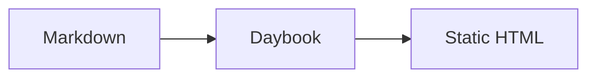

Daybook 以 Goldmark 解析 Markdown，并在其上加入 GFM、Obsidian 兼容语法和少量面向博客的扩展。日常写作仍然可以从标准 Markdown 开始；只有需要双链、嵌入或特殊组件时，才需要额外语法。

文章元数据本身不属于 Markdown 正文。它写在文件顶部的 YAML frontmatter 中，详见 [[frontmatter|文章 Frontmatter]]。

## 标准 Markdown 与 GFM

### 标题与文本

```markdown
## 二级标题
### 三级标题

**加粗**
*斜体*
~~删除线~~
`inline code`
```

Daybook 的文章目录收集二级到四级标题。普通链接、自动链接、水平线和引用块都按常见 Markdown 方式书写。

### 列表与任务

```markdown
- Item
  - Nested item

1. First
2. Second

- [x] Done
- [ ] Todo
```

### 表格

```markdown
| Field | Meaning |
| --- | --- |
| `title` | Article title |
| `date` | Publication date |
```

### 脚注

源 Markdown：

```markdown
Daybook 使用 Goldmark 解析正文。[^goldmark]

[^goldmark]: 脚注会被集中渲染到文章末尾。
```

实际效果：

Daybook 使用 Goldmark 解析正文。[^goldmark]

[^goldmark]: 脚注会被集中渲染到文章末尾。
### 链接

源 Markdown：

```markdown
[Daybook on GitHub](https://github.com/StatIndet/daybook)

<https://github.com/StatIndet/daybook>
```

实际效果：

[Daybook on GitHub](https://github.com/StatIndet/daybook)

<https://github.com/StatIndet/daybook>

### 代码块

为 fenced code block 标注语言即可启用语法高亮：

````markdown
```go
package main

import "fmt"

func main() {
    fmt.Println("hello")
}
```
````

^64da35

渲染后的代码块带有复制按钮。无语言标记的代码块仍保持普通等宽排版。

### 图片与图注

标准 Markdown 图片可以直接使用远程 URL：

```markdown

```

Daybook 会把普通 `alt` 作为图注。若 `alt` 以 `_` 开头，或 `alt` 为空，则不显示图注：

```markdown


```

Vault 内附件更适合使用 Obsidian embed，具体见 [[obsidian-media-local-remote-test|附件与远程媒体]]。

## Obsidian 双链

Daybook 会解析 Obsidian 的 `[[...]]` 语法。目标可以使用文章标题、slug 或 Markdown 文件名；也可以追加别名、小节或块 ID。

### 链接文章

源 Markdown：

```markdown
[[静夜思]]
[[Shakespeare|English-only Shakespeare example]]
```

实际效果：

[[静夜思]]

[[Shakespeare|English-only Shakespeare example]]

### 链接文章小节

源 Markdown：

```markdown
[[typography-test#4. 行内代码与代码块测试|查看代码排版]]
```

如果目标文章中不存在这个标题，Daybook 会在构建阶段输出 `obsidian/missing-heading` 警告。

### 块 ID

在文本块末尾添加 `^block-id`，即可让这个块成为可嵌入目标。

源 Markdown：

```markdown
这是一个可以被精确嵌入的段落。 ^syntax-block-demo
```

实际效果：

这是一个可以被精确嵌入的段落。 ^syntax-block-demo

当前 Daybook 主要将 block ID 用于 `![[note#^block-id]]` 块级嵌入；普通 Wikilink 暂不生成精确的块锚点跳转。块 ID 只使用字母、数字与连字符最稳妥。

## Obsidian 页面与局部嵌入

在双链前添加 `!`，Daybook 会把目标内容直接嵌入当前文章。

### 整篇文章嵌入

源 Markdown：

```markdown
![[静夜思]]
```

实际效果：

![[静夜思]]

### 小节嵌入

源 Markdown：

```markdown
![[typography-test#常见强调]]
```

实际效果：

![[typography-test#常见强调]]

### 块级嵌入

源 Markdown：

```markdown
![[markdown-syntax#^syntax-block-demo]]
```

实际效果：

![[markdown-syntax#^syntax-block-demo]]

Daybook 会限制嵌入递归深度，并检测循环引用，避免两篇文章相互嵌入后无限展开。

## Obsidian 高亮与注释

高亮：

```markdown
==important text==
```

渲染为 ==important text==。

注释使用 `%%` 包裹。它们保留在 Markdown 源文件中，但不会出现在最终 HTML：

```markdown
%% 这段内容只留在源文件中。 %%
```

代码和数学内容会先被保护，不应因为其中出现 `==` 或 `%%` 而被当作高亮或注释。

## Callout

Obsidian 风格：

```markdown
> [!note]
> A short note.

> [!warning]- 默认折叠
> 点击标题展开。

> [!tip]+ 默认展开
> 仍然可以手动收起。
```

常用类型包括 `note`、`tip`、`important`、`warning`、`caution`、`abstract`、`info`、`todo`、`success`、`question`、`failure`、`danger`、`bug`、`example` 与 `quote`。`faq`、`hint`、`tldr` 等常见别名也会映射到对应类型。

Daybook 还支持容器写法：

```markdown
:::note[自定义标题]
这里仍然可以写 **Markdown**。
:::
```

## Daybook 容器

### 折叠块

```markdown
:::fold[展开查看]
这里可以放较长的补充内容。
:::
```

### 画廊

```markdown
:::gallery


:::
```

## Mermaid

使用 `mermaid` 或 `{mermaid}` 作为代码块语言：

````markdown

````
## 数学公式

含有数学公式的文章应在 frontmatter 中设置：

```yaml
math: true
```

然后使用行内 `$...$` 或块级 `$$...$$` 数学语法。完整效果可查看 [[KaTeX 数学公式测试|KaTeX 数学公式测试]]。

## 外部内容与媒体

Daybook 的 leaf directive 必须单独占一行，属性使用引号：

```markdown
::github{repo="StatIndet/daybook"}
::youtube{id="9pP0pIgP2kE"}
::bilibili{id="BV1sK4y1Z7KG"}
::spotify{url="https://open.spotify.com/track/0HYAsQwJIO6FLqpyTeD3l6"}
::tweet{url="https://x.com/example/status/1234567890"}
::codepen{url="https://codepen.io/example/pen/example"}
```

图片、视频、音频、PDF 与音乐播放器分别使用 `::image`、`::video`、`::audio`、`::pdf` 和 `::music`。参数与本地附件的区别见 [[obsidian-media-local-remote-test|附件与远程媒体]]。

如果想直接查看这些组件组合后的页面，可阅读 [[Markdown扩展语法测试页|Markdown 扩展语法测试页]]。
